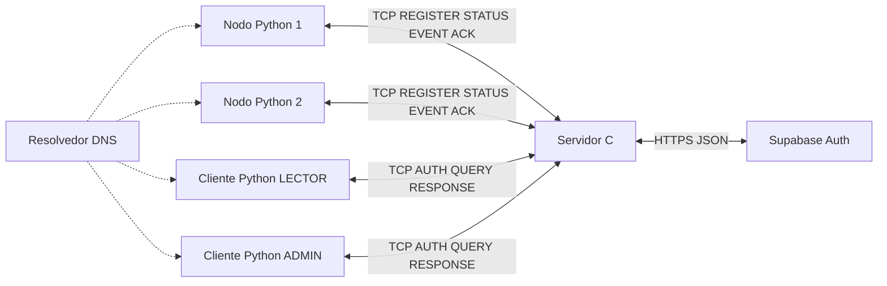

# Informe de implementación y guía de sustentación

## Alcance

Se implementó la propuesta de Fase 1 que estaba en el repositorio, contrastada con
las nueve páginas de «Entrega 1 - sockets (2).pdf». La propuesta se conserva como
evidencia original. Este informe y PROTOCOLO.md describen el resultado de las fases
2 y 3; no atribuyen implementación previa al documento inicial.

## Arquitectura

El socket de escucha acepta conexiones; cada una es atendida por un pthread. Se
elige este modelo por su claridad para el tamaño acotado del proyecto. La tabla
compartida y los logs tienen mutex independientes. No se ejecuta send ni una consulta
HTTPS sosteniendo el mutex de la tabla: una red lenta no impide actualizar otros nodos.

## Matriz de requisitos

| Requisito del enunciado | Implementación y verificación |
|---|---|
| Dos nodos, servidor y clientes | Procesos independientes; prueba con nodo1/nodo2 y clientes LECTOR/ADMIN |
| Comunicación indirecta nodo-cliente | Toda consulta lee la tabla del servidor |
| Registro de nodos | REGISTER, reserva de identificador y rechazo NODE_IN_USE |
| Información periódica | STATUS cada 5 s; CPU, temperatura, NORMAL/ALERTA simulados |
| Eventos y confirmación | EVENT, ACK, cola del nodo y mayor id aceptado por servidor |
| Estado actualizado | ACTIVO, SIN_DATOS tras 15 s, DESCONECTADO al detectar cierre |
| Históricos | Últimas cinco muestras y últimos cinco eventos |
| Consultas | CURRENT/HISTORY/EVENTS; filas delimitadas por fin |
| Clientes concurrentes | pthread por conexión; prueba de 40 consultas con 20 trabajadores |
| DNS, sin IP fija | getaddrinfo en C; socket.create_connection/getaddrinfo en Python |
| Fallo DNS sin terminar | Reintento del listener, nodos y clientes; pruebas de recuperación en clientes |
| Autenticación y perfiles | Integración Supabase HTTPS; app_metadata.perfil LECTOR/ADMIN |
| Servidor solo C/Berkeley | socket, bind, listen, accept, recv, send, close en server.c |
| Logs consola y archivo | RX/TX/CONNECT/CLOSE, fecha y origen IP:puerto; claves redactadas |
| Puerto y archivo por consola | ./build/server puerto archivoDeLogs |
| Excepciones y límites | Validación de formato/rangos, longitud, timeout, desconexiones, capacidad |
| Makefile | Compilación gcc C11 estricta y objetivo make test |
| Especificación completa | docs/PROTOCOLO.md y ejemplos reproducibles en README |

**Configuración externa verificada:** el 30 de septiembre de 2026 se configuró
Supabase y se inició sesión con las cuentas de laboratorio ADMIN y LECTOR desde
el cliente Python. Las capturas aportadas por el equipo muestran ambos perfiles,
consultas de estado e históricos y autorización de eventos: ADMIN obtiene datos
y LECTOR recibe FORBIDDEN. La prueba manual también mostró nodo1 DESCONECTADO
mientras nodo2 continuaba ACTIVO. Véase [VERIFICACION.md](VERIFICACION.md).

Esta prueba utilizó el proveedor real por HTTPS. La suite automatizada conserva
un proveedor simulado exclusivo de `server-test`; son verificaciones distintas.

## Cambios concretos respecto de la propuesta

- Se eligió json-c como biblioteca JSON pequeña en lugar de la sugerencia cJSON;
  libcurl sigue limitado a la integración auxiliar HTTPS.
- Los nodos incorporan sufijo de ejecución por defecto para evitar colisiones de
  ids al reiniciar; `--stable-id` permite los nombres simples de la demostración.
- Se concretaron los límites de 256 nodos, 128 conexiones y 1000 eventos pendientes.
- La interfaz de consulta son tablas en terminal. El enunciado recomienda una
  visualización sencilla y no obliga a que sea gráfica.
- Logs de peticiones inválidas omiten el cuerpo completo para no divulgar una clave
  enviada en un AUTH malformado. Los mensajes válidos no sensibles se registran completos.
- Se agregó integración continua para repetir `make test` en GitHub.

## Pruebas reproducibles

Ejecutar `make test` en Debian/Ubuntu. Las pruebas levantan procesos C y sockets TCP
reales en puertos libres, y los detienen al finalizar. No necesitan credenciales ni
cuentas externas. El proveedor simulado únicamente existe en las pruebas.

La suite cubre: dos nodos y cinco muestras; perfiles; múltiples clientes; registro
duplicado; nodo desconocido; campos, números e ids inválidos; líneas fragmentadas o
agrupadas; longitud excesiva; bytes ilegales; timeout parcial; conexión desconectada
y muestras vencidas; errores/timeout del proveedor; redacción de logs; ejecución de
los programas Python; ACK no leído y reenvío sin duplicación; cinco eventos recientes;
rechazo de HTTP en el servidor normal; recuperación ante fallos DNS en los clientes.

## Preguntas para la sustentación

**¿Por qué recv no equivale a recibir un mensaje?** TCP es un flujo. El servidor
acumula bytes hasta LF, conserva líneas parciales y procesa varias líneas de un recv.

**¿Por qué se necesita ACK de EVENT si TCP es confiable?** TCP confirma bytes a nivel
de transporte; el ACK del protocolo confirma que la aplicación aceptó el evento.
Si el ACK no llega, el nodo no sabe si se procesó y reenvía el mismo id.

**¿Cómo se evitan eventos duplicados?** Un solo evento en vuelo, ids crecientes y
mayor id aceptado por nodo. Un reenvío antiguo se confirma sin insertarlo otra vez.

**¿Qué se pierde en un reinicio?** Métricas y deduplicación del servidor, y cola del
nodo si ese proceso se cae. El log permanece, pero no existe recuperación automática.

**¿Cómo se impide que LECTOR consulte eventos?** El servidor verifica el perfil en
cada QUERY; ocultar una opción del cliente no sería autorización suficiente.

**¿Por qué app_metadata?** Es administrado por el proveedor/equipo; user_metadata
puede ser modificado por el usuario y no se acepta como fuente de permisos.

**¿Por qué no usar UDP?** Sería válido para STATUS, pero eventos y consultas necesitarían
reglas adicionales de confiabilidad. El diseño eligió TCP por simplicidad, con el costo
de bloqueo por pérdida de segmentos y conexiones persistentes.

**¿Cómo se evita una carrera?** Registro, actualización y copia de consultas ocurren
bajo el mutex de estado. Los envíos se hacen sobre copias fuera de ese mutex.

**¿Está cifrado todo?** No. Solo la conexión al proveedor usa HTTPS. La demostración
TCP se limita a una red de laboratorio y claves de prueba, como indicó la propuesta.

## Lista para entregar por el equipo

1. Supabase y ambos perfiles ya fueron comprobados con el proveedor real; conservar
   las credenciales de laboratorio y la configuración local para la sustentación.
2. Repetir la demostración y `make test` en el equipo de sustentación; la prueba
   manual local ya se realizó y quedó descrita en VERIFICACION.md.
3. Añadir los nombres reales de integrantes según la presentación requerida.
4. Verificar que la versión a evaluar esté en GitHub y enviar el enlace en el buzón
   del curso. El enunciado fija el 30 de septiembre de 2026 a las 23:59.
5. Cada integrante debe entender y explicar el código; el repositorio no sustituye
   la sustentación oral ni el envío al buzón.

No se crearon commits retrospectivos ni evidencia ficticia de entregas anteriores.
